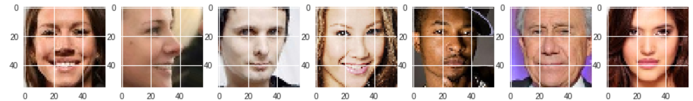

# CNN\_with Keras\_for\_image\_classification

@autor : Valentin Larrieu

# Report

The goal of this document is to sum up the principal actions done in order to study the dataset Given. It is composed of images of face of people. They have been centered so that the eyes, nose, and mouth are at the same place on each picture. It&#39;s a binary classification problem.

1. 1Dataset Exploration

The first things done was to visualize the data given:

 

I then tried to guess what could be the identified features and thus tried method to confront it:

- Identify eye or hair color
- Identify if the mouth or eyes are open
- Identify male or female
- Identify computer generated images
- Identify if a ratio is bigger than a value (for instance height over length of face)

1. 2Splitting the data to reduce overfit

The code given was not making a proper train and test split. In fact the score given by on the leader board was done with data already given. Thus it is really easy to get 100% of accuracy on it. But doing so would mean overfitting and bad results for the day with the real test set.

That's why I implemented a proper way of splitting data: here I did 90% for train, 5% for validation and 5% for test.

1. 3First model

The first model tried was a simple LGBM trained on the full set. Submitting it in the challenge gave a score of 0.91 which was very high and gave me the idea to look further at the data. That&#39;s how I saw the test of challenge was in our data and thus giving us very high score.

But with the split I did I was able to evaluate correctly my model.

1. 4Building a the first CNN model

As this challenge is about image recognition, it was obvious to try some deep learning techniques. I implemented a simple model with Keras :

- Some Convolutionnal filters
- Some  fully connected layers.

The score this model gave was 0.59. Through the epoch the score was lock at this score. It meant I had to change my model

1. 5Complexifying the model

I then complexified the model in order to be able to get more relations from the data. The model implemented is the following:

- 3 layers of 32 convolutionnal filters (kernel size 3)
- 3 layers of 64 convolutionnal filters (kernel size 5)
- 4 layers of 128 convolutionnal filters (kernel size 7)
- 4 layers of 256 convolutionnal filters (kernel size 9)

- 3 fully connected layers (1024 / 2048 / 1024)
- The dense sigmoid
- Some dropout and batch normalization between that

The score given was 99% of submission with it. But it&#39;s the same problem as before, I was training with the whole set and overfitted. So when I properly used dev and test set I got a more accurate score of 83-84%

1. 6Evaluation of the model

In order to have more element than just the scores, I added some history object to be able to plot the evolution of the model through time.

This model gave this kind of curve:

  
 
As we can see it takes approximately 3 epoch to converge and then start overfitting.

1. 7Visualisation the filters

Another element to know which feature was identified by the classifier would be to see what the filters end up identifying. To do that we train our network then select an image that will be our way of visualizing what the filter identify. What we do is identify the exit of the different layer of our model with that image given.

The image given is the following:

 

We then look at what it looks through the network.

At the beginning:

 

In the middle:

 

At the end:

 

As we can see, it seems our network look at every part of the picture. Identifying a more important part could have led us to the feature. Here we did not saw it clearly.

Knowing the feature could help us to implement proper preprossing to simplify the task for the network (for example if it was eyes color, we would just crop the eyes and send it to the network).

So to improve the score I tried to improve the network. I added more layers, more neurons but the score was almost the same. I then tried a different approach and simplified the network and did some hyperparameter tunning

1. 8Improving the model

In order to improve the model I tried different architectures and hyper parameter tunning:

- A simpler model
- Increase dropout
- Increase batch size
- Decrease batch size
- Increase learning rate
- Decrease learning rate
- Add Relu between convolutions

The simpler model gave the same results as the complex model so it was used for the others to be able to compare.

Here are the comparison of the models ( the bigger learning is not shown here cause it got stuck to 0.59 thus making the other curse hard to see):

 

1. 9Limitation, unsuccessful try

I tried a lot of methods including data augmentation. The package ImageDataGenerator allow to generate images on the go while the batch is taking images. It provides a lot of parameters to choose the kind of data augmentation we want: how much we want to rotate pick, if we generate zoomed pics, brighter or darker and so on.

The potential it had was to give us a bigger dataset to get better score (reduce overfitting). It could also have helped us identifying the feature (for example if rotating make the score drop we can get some ints, same with brightness and the other things).

Noneless, even if implementing it is quite easy, the machine provided by collab was not able to do handle it. 2 different problem came:

- physical limitation with a lack of RAM available
- impossibility to use it with TPU

Even tho it worked on the CPU version, epoch were lasting hours while on TPU it was a matter of minutes. I thought it would not be good to use a model that would take hours/days to train.

At the end, the package was successfully implemented and I was able to try some modification: zooming, moving vertically or horizontally was not improving the result but using the mirror image to augment the dataset improved the score.

1. 10 Going beyond

I did some choices in this study because I thought they were meaningful in my case:

- Only use a network I was understanding and mastering (that means not use a pretrained model or a very complicated one)
- Not try to put a very tiny learning rate, because doing that would have increased a bit my score, but would have drastically increased the learning time (which is not something you can do in production when you test models)
- Not run a lot of kernel with the same code to get the best shuffling giving me the best score on THAT test set

The ways to improve the score I got if had more time would be:

- Try more feature augmentation with the image generator package
- Use feature augmentation to guess the classifying characteristic
- Try more complicated networks such as Inception for instance
- Fine tune the model (like the learning rate which I could have decreased to improve the training)